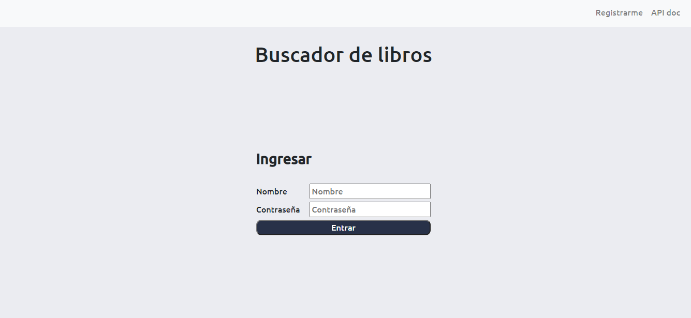
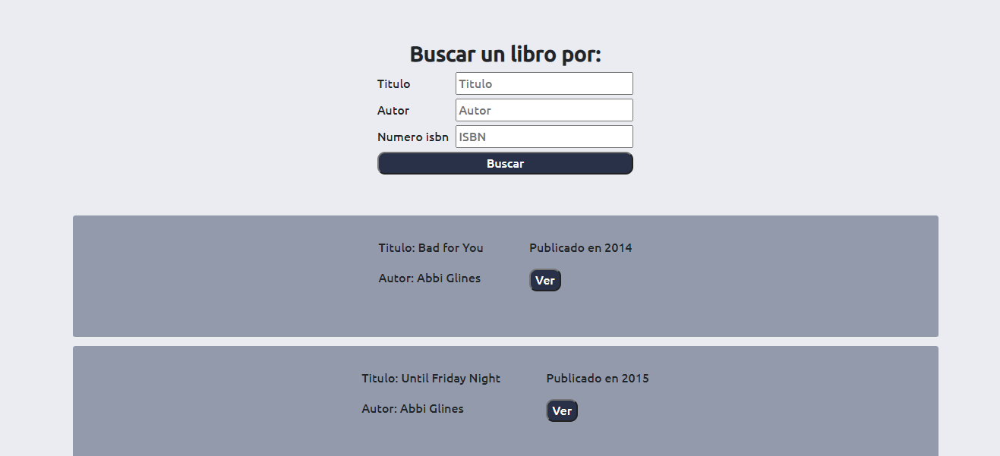
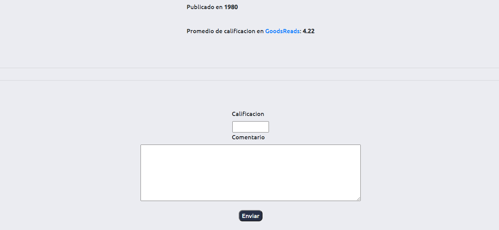
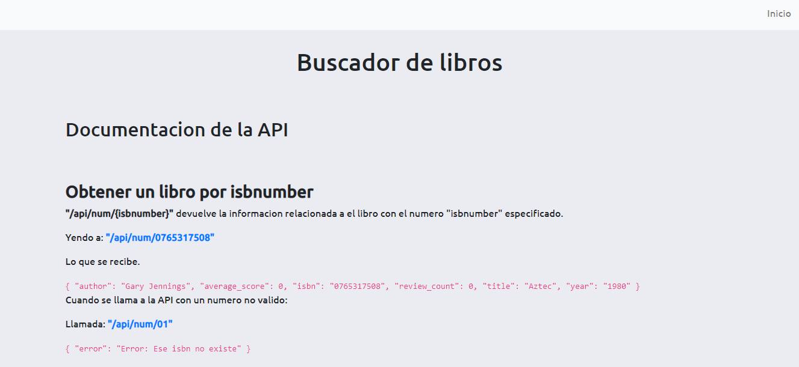

# Buscador de libros.
# Español
## Descripcion general
Aplicacion web para calificacion de libros.  
La aplicacion consta de dos funcionalidades principales. La primera consiste en poder buscar libros por nombre, autor o numero isbn, calificar ese libro y dejar la opinion.  
La segunda funcionalidad consiste de una API muy basica con la cual se puede acceder a todos los libros disponibles, obtener los numeros isbn correspondientes a cada libro, y obtener las reviews de un cada libro.  

## Tecnologias utilizadas.  
La aplicacion web fue construida con flask, postgresql, HTML y CSS.  

## Capturas de pantalla.

  
Al ingresar a la pagina, se puede ingresar con un usuario y una contraseña, registrarse o ir a la documentacion de la api.

  
Una vez ingresado con el usuario y la contraseña, se puede buscar un libro por titulo, autor o numero isbn; los resultados seran mostrados debajo.  

  
Clickeando en algun libro, se redirecciona a la pagina del libro, donde se muestran algunos detalles sumandose la posibilidad de calificar y dejar la opinion del libro.  

  
Por ultimo yendo a la documentacion de la api, se pueden ver los endpoints disponibles con su respuesta asociada.

## Aplicacion 
**Para ver la aplicacion en vivo, dirigirse a este [link](https://buscador-libros.herokuapp.com/)**

# English

## Description  
Web app for books reviews. The application has two main functionalities. The first one consists of lookig for books by name, author or isbn number, rate the book and leave an opinion. 
The second functionality consists of a very basic API with which you can access all the available books, get the isbn numbers for each book and get the reviews for each book.

## Used tools.
The application was build with flask, postgresql, HTML and CSS

## Screanshoots.

 
You can log in with an user and a password, register or go to the api documentation. 

  
You can search for a book by title, author or isbn number. The results will be shown below. 

  
By clicking on any book, you will be redirected to the book page where the details will be displayed and you can leave an opinion.  

 
You can access to the api documentation where you can see all the available endpoints. 

## Application 
**You can access to the application by clicling [here](https://buscador-libros.herokuapp.com/)**
